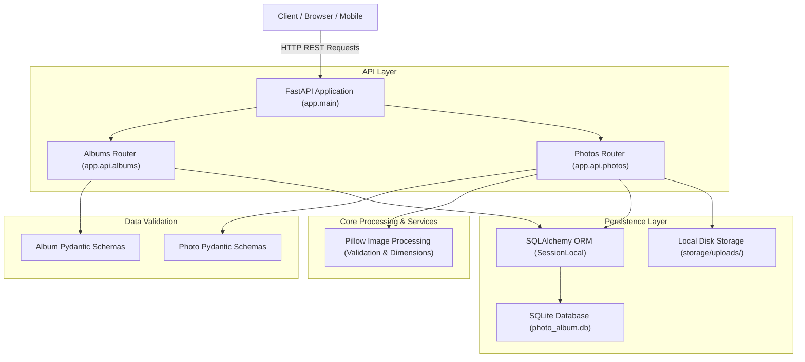
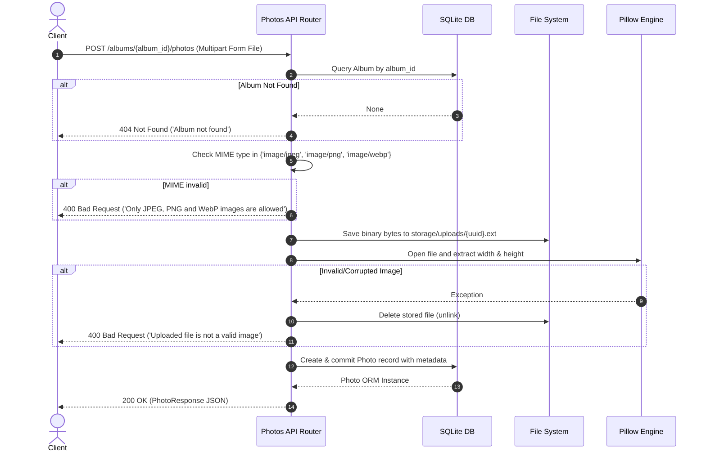

# Architecture & System Design

This document details the architectural principles, component structure, data flow, and file storage strategies implemented in the **Photo Album API**.

---

## 🏛️ System Overview

The Photo Album API is built as a multi-tier, modular web application following modern RESTful API principles and clean code separation.

---

## 🧩 Architectural Layers

### 1. Presentation & Routing Layer (`app/main.py`, `app/api/`)
- **FastAPI Core**: Handles routing, dependency injection (`Depends(get_db)`), HTTP exception formatting, and OpenAPI schema generation.
- **Albums Router (`app/api/albums.py`)**: Handles album creation, listing, retrieval, and deletion.
- **Photos Router (`app/api/photos.py`)**: Includes `album_photo_router` (album-scoped photo uploads and list) and `photo_router` (photo media download/streaming).

### 2. Schema Validation Layer (`app/schemas/`)
- Uses **Pydantic** models to validate incoming HTTP request payloads and structure outgoing JSON responses.
- Enforces data types and `from_attributes = True` compatibility for SQLAlchemy ORM conversion.

### 3. Business & Processing Layer
- **Pillow (`PIL.Image`) Integration**: Validates image binary contents to prevent corrupted uploads or file spoofing. Reads image dimensions (`width` and `height`) dynamically.
- **UUID File Generator**: Generates cryptographically secure, unique filenames using Python `uuid4` to prevent file collisions and directory traversal attacks.

### 4. Persistence Layer (`app/models/`, `app/database.py`)
- **SQLAlchemy ORM (v2.0)**: Manages database sessions with unit-of-work transaction management (`commit`, `rollback`, `refresh`).
- **SQLite Engine**: Stores relational records locally in `photo_album.db`. Configured with `connect_args={"check_same_thread": False}` to support concurrent thread access via FastAPI.

### 5. File System Storage (`storage/uploads/`)
- Dedicated local directory for binary image storage.
- Disconnected from raw database IDs to enhance security.

---

## 🔄 Photo Upload Lifecycle & Workflow

The upload process follows a strict transaction safety pattern to ensure data consistency between disk storage and database records:

---

## 🔒 Security & Reliability Measures

1. **UUID Naming Isolation**: Files saved on disk use random UUID strings (e.g., `c4ae0cbd-a146-4301-a2f1-57a797007a41.jpg`). Original filenames are preserved only in database metadata.
2. **Double Validation (MIME & Binary)**: Content headers are verified first, followed by strict binary header verification via `Image.open()`.
3. **Orphan File Cleanup**: If image verification fails after writing to disk, the temporary file is unlinked immediately to prevent storage leaks.
4. **Relational Cascades**: Deleting an `Album` automatically deletes linked `Photo` database records (`cascade="all, delete"`).
