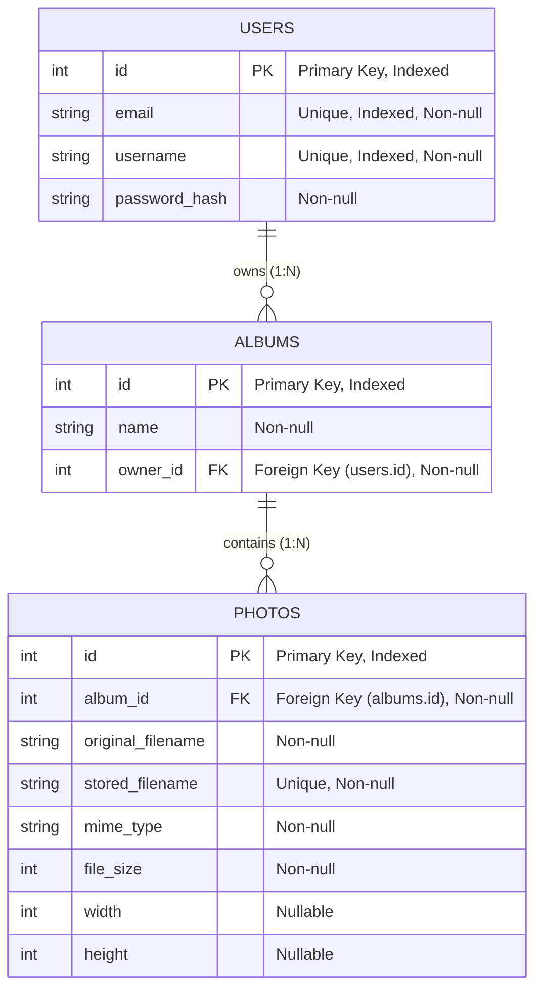

# Database Schema & Data Models

This document describes the database design, entity relationships, column definitions, and constraints for the **Photo Album API**.

---

## 📊 Entity Relationship (ER) Diagram

---

## 🗄️ Tables Breakdown

### 1. `users` Table
Stores registered application user accounts.

| Column | Type | Constraints | Description |
|---|---|---|---|
| `id` | `INTEGER` | Primary Key, Autoincrement, Index | Unique user identifier |
| `email` | `VARCHAR` | Unique, Index, NOT NULL | User's email address |
| `username` | `VARCHAR` | Unique, Index, NOT NULL | Unique display handle |
| `password_hash` | `VARCHAR` | NOT NULL | Password hash string |

- **ORM Relationships**:
  - `albums`: One-to-Many relationship with `Album` (`cascade="all, delete"`). Deleting a user deletes all their albums.

---

### 2. `albums` Table
Stores album containers owned by users.

| Column | Type | Constraints | Description |
|---|---|---|---|
| `id` | `INTEGER` | Primary Key, Autoincrement, Index | Unique album identifier |
| `name` | `VARCHAR` | NOT NULL | Title/Name of the album |
| `owner_id` | `INTEGER` | Foreign Key (`users.id`), NOT NULL | Owner user ID |

- **ORM Relationships**:
  - `owner`: Many-to-One relationship with `User`.
  - `photos`: One-to-Many relationship with `Photo` (`cascade="all, delete"`). Deleting an album automatically deletes all associated photos in the database.

---

### 3. `photos` Table
Stores photo metadata and references to image files stored on disk.

| Column | Type | Constraints | Description |
|---|---|---|---|
| `id` | `INTEGER` | Primary Key, Autoincrement, Index | Unique photo identifier |
| `album_id` | `INTEGER` | Foreign Key (`albums.id`), NOT NULL | Parent album ID |
| `original_filename` | `VARCHAR` | NOT NULL | Original uploaded filename (e.g. `vacation.png`) |
| `stored_filename` | `VARCHAR` | Unique, NOT NULL | Generated UUID filename on disk (e.g. `c4ae0cbd-....jpg`) |
| `mime_type` | `VARCHAR` | NOT NULL | MIME content type (e.g. `image/jpeg`) |
| `file_size` | `INTEGER` | NOT NULL | File size in bytes |
| `width` | `INTEGER` | Nullable | Image width in pixels extracted via PIL |
| `height` | `INTEGER` | Nullable | Image height in pixels extracted via PIL |

- **ORM Relationships**:
  - `album`: Many-to-One relationship with `Album`.

---

## ⚙️ Engine & Database Configuration

- **Database Engine**: SQLite (`photo_album.db` at project root).
- **ORM Configuration**: SQLAlchemy 2.0 with Declarative Mapping (`Base = declarative_base()`).
- **Connection Flags**: `connect_args={"check_same_thread": False}` allows multi-threaded request processing in FastAPI while sharing a single SQLite session manager.
- **Auto-Table Creation**: Tables are created automatically on startup via `Base.metadata.create_all(bind=engine)` in `app/main.py`.
